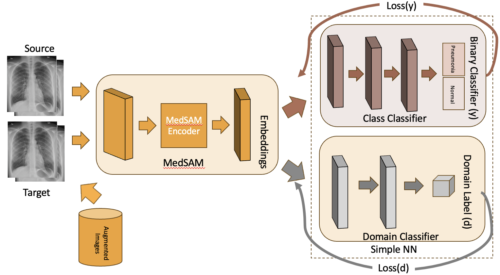
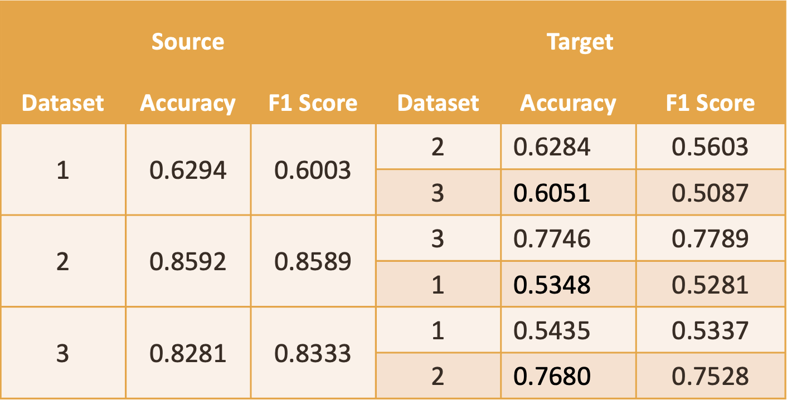

# MedSam_Pneumonia
This is a project for the Chest X-Ray Image Classification - Pneumonia. The goal of this project is to classify chest X-ray images into two classes: normal and pneumonia. 
This code can be applied to any medical image classification task.

It leverages MedSAM model. https://github.com/bowang-lab/MedSAM

## Dataset
| Dataset                                                                      | Total images  | Normal vs Pneumonia           |
|------------------------------------------------------------------------------|---------------|-------------------------------|
| [Dataset1](https://www.kaggle.com/c/rsna-pneumonia-detection-challenge/data) | 26684         | Normal: 20672 Pneumonia: 6012 |
| [Dataset2](https://www.kaggle.com/datasets/paultimothymooney/chest-xray-pneumonia) | 5856          | Normal: 1341 Pneumonia: 3875  |
| [Dataset3](https://www.kaggle.com/datasets/sachinkumar413/covid-pneumonia-normal-chest-xray-images?select=COVID) | 3602         | Normal: 1802 Pneumonia: 1800  |

## Execute the code
Use GPU to run the code for fetching embeddings. We have downloaded all the embeddings of the above 3 datasets and also saved it.

## Different Implementations
1. MedSAM Embeddings
   - This network integrates the MedSAM model and employs a Multi-layer Perceptron Neural Network for the pneumonia classification task.The CX-MedSAM network is trained on labeled data from the source domain. The process involves feeding chest X-ray images into the MedSAM image encoder, generating image embeddings with a dimensionality of 1 million. Due to the computational expense, average pooling is applied to reduce the dimensionality to 256. The resulting embeddings are then input into a Multi-layer Perceptron Neural Network, consisting of three fully connected layers with ReLU activation functions, and culminating in a sigmoid activation for binary classification.
   
2. Contrastive Loss
    - The contrastive loss function is used to train the network. The contrastive loss function is a metric learning loss function that aims to minimize the distance between similar images and maximize the distance between dissimilar images. The contrastive loss function is defined as:
   
3. DANN 
    - Domain Adaptation Neural Network (DANN) is a deep learning model that is used to transfer knowledge from a source domain to a target domain. The DANN model consists of three components: a feature extractor, a domain classifier, and a label classifier. The feature extractor is a convolutional neural network that extracts features from the input data. The domain classifier is a neural network that predicts the domain of the input data, and the label classifier is a neural network that predicts the label of the input data. The DANN model is trained using a combination of supervised learning and domain adaptation techniques.
   
4. DANN + Augmentation 
    - This is similar to DANN architecture only difference is it contains the Augmented Images as well.
      We have tried MEDIGAN, trivial augment and we finally come up with our custom function to create the augmented images.
   
Note: For more details please refer to the report.

## Results
1. MedSAM Embeddings
   
2. Contrastive Loss
   
3. DANN
   
4. DANN + Augmentation
   

## Reference

```
@article{MedSAM,
  title={Segment Anything in Medical Images},
  author={Ma, Jun and He, Yuting and Li, Feifei and Han, Lin and You, Chenyu and Wang, Bo},
  journal={arXiv preprint arXiv:2304.12306},
  year={2023}
}
```